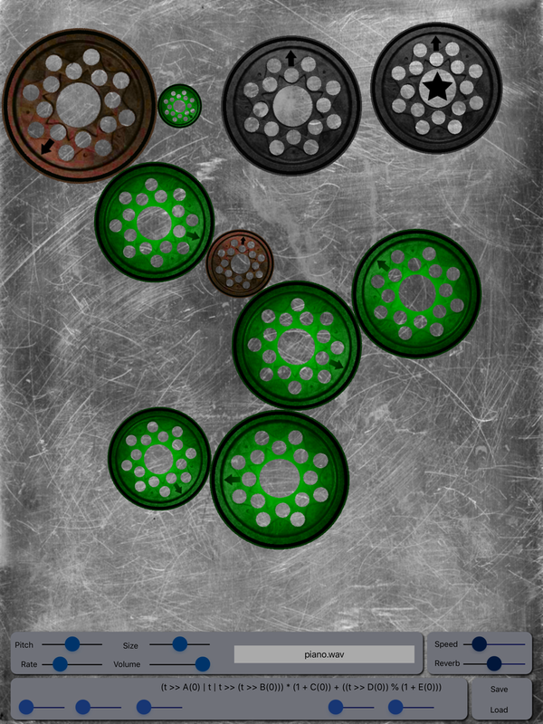

# GearTone
Algorhythmic music for iPad

A simple noise app to help you break your lease and lose a girl friend.

http://countercomplex.blogspot.com/2011/10/algorithmic-symphonies-from-one-line-of.html

Let the computer create a melody with an algorithm!
This app combines that idea with gears that determine \
the relative timing and tone for each note.

1. Click on a gear to give it focus (marked with a star). 
2. Click on the tone name to launch the tone picker dialog.
3. Adjust other params as necessary for beautiful effect.
4. Move the gears around to build the tone bank.

The sliders at the bottom affect the music algorithm,\
where the 't' cycles through 0..255

we're using:\
v  = (t >> param[0] | t | t >> ((t >> param[1]) & 0xF)) * (1 + param[2]) + ((t >> param[3]) % (1 + param[4]));\
an alternate is:\
v = (t * (t >> param[0] * (t >> param[1] | t >> param[2]) & (param[3] | (t >> param[4]) * param[5] >> (t & 15) | t >> param[6])));

I'm old enough to remember writing assembly language for the TRS-80 so that it 'played music' as\
static on a nearby radio tuned between stations.  This is a step up from that.

